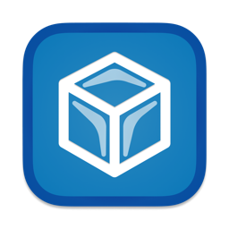

<div align="center">
    
    <h1>Ice</h1>
</div>

Ice is a powerful menu bar management tool. While its primary function is hiding and showing menu bar items, it aims to cover a wide variety of additional features to make it one of the most versatile menu bar tools available.


[](https://github.com/jordanbaird/Ice/releases/latest)


[](https://github.com/sponsors/jordanbaird)
[](https://icemenubar.app)
[](LICENSE)

> [!NOTE]
> Ice is currently in active development. Some features have not yet been implemented. Download the latest release [here](https://github.com/jordanbaird/Ice/releases/latest) and see the roadmap below for upcoming features.

<a href="https://www.buymeacoffee.com/jordanbaird" target="_blank">
    
</a>

## Install

### Manual Installation

Download the "Ice.zip" file from the [latest release](https://github.com/jordanbaird/Ice/releases/latest) and move the unzipped app into your `Applications` folder.

### Homebrew

Install Ice using the following command:

```sh
brew install --cask jordanbaird-ice
```

## Features/Roadmap

### Menu bar item management

- [x] Hide menu bar items
- [x] "Always-hidden" menu bar section
- [x] Show hidden menu bar items when hovering over the menu bar
- [x] Show hidden menu bar items when an empty area in the menu bar is clicked
- [x] Show hidden menu bar items by scrolling or swiping in the menu bar
- [x] Automatically rehide menu bar items
- [x] Hide application menus when they overlap with shown menu bar items
- [x] Drag and drop interface to arrange individual menu bar items
- [x] Display hidden menu bar items in a separate bar (e.g. for MacBooks with the notch)
- [x] Search menu bar items
- [x] Menu bar item spacing (BETA)
- [ ] Profiles for menu bar layout
- [ ] Individual spacer items
- [ ] Menu bar item groups
- [ ] Show menu bar items when trigger conditions are met

### Menu bar appearance

- [x] Menu bar tint (solid and gradient)
- [x] Menu bar shadow
- [x] Menu bar border
- [x] Custom menu bar shapes (rounded and/or split)
- [ ] Remove background behind menu bar
- [ ] Rounded screen corners
- [ ] Different settings for light/dark mode

### Hotkeys

- [x] Toggle individual menu bar sections
- [x] Show the search panel
- [x] Enable/disable the Ice Bar
- [x] Show/hide section divider icons
- [x] Toggle application menus
- [ ] Enable/disable auto rehide
- [ ] Temporarily show individual menu bar items

### Other

- [x] Launch at login
- [x] Automatic updates
- [ ] Menu bar widgets

## Why does Ice only support macOS 14 and later?

Ice uses a number of system APIs that are available starting in macOS 14. As such, there are no plans to support earlier versions of macOS.

## Gallery

#### Show hidden menu bar items below the menu bar


#### Drag-and-drop interface to arrange menu bar items


#### Customize the menu bar's appearance


#### Menu bar item search


#### Custom menu bar item spacing


## License

Ice is available under the [GPL-3.0 license](LICENSE).
